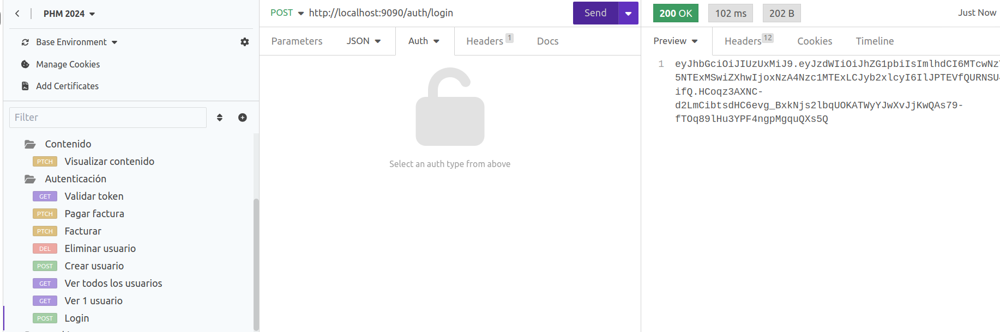
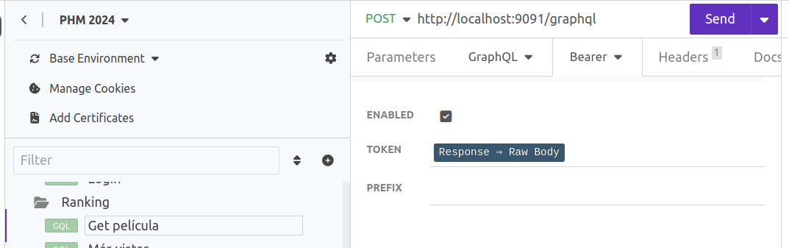
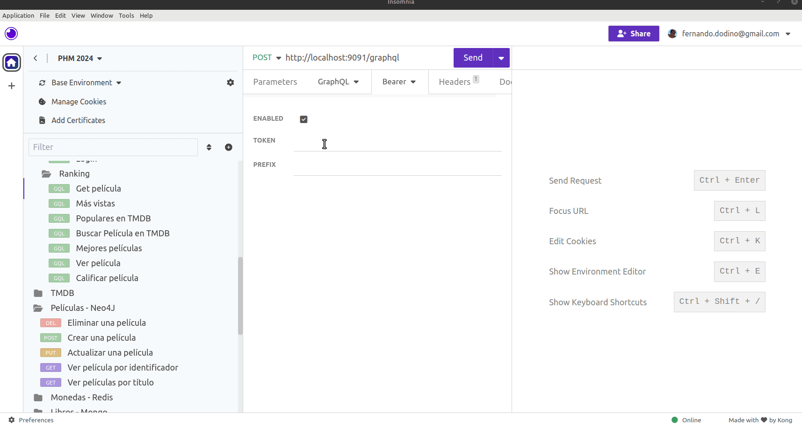

# Monorepo Ejemplo de Películas - Microservicios en Springboot

Esta es la página principal del ejemplo de Películas construido a partir de una serie de microservicios en Springboot. Podés ver a continuación

- [**auth**: el módulo de autenticación y facturación](./peliculas-microservice-auth/README.md)
- [**ranking**: el catálogo de las películas con el ránking propio y las estadísticas de visualización](./peliculas-microservice-ranking/README.md)
- [**content**: el servicio que permite acceder al contenido almacenado en caches e informar visualizaciones](./peliculas-microservice-content/README.md)
- [**registry**: el server que funciona como registro de los microservicios](./peliculas-microservice-registry/README.md)

La arquitectura general podemos verla en este diagrama de alto nivel:

## Para testear los endpoints

Te dejamos el archivo en formato [json](./peliculas-microservice-endpoints.json) (también tenés en formato [har](./peliculas-microservice-endpoints.har) para POSTMAN). Dado que los endpoints tienen seguridad, lo primero que tenés que hacer es

- ejecutar el login del microservicio auth:

Como respuesta recibís el token que tenés que usar en los demás endpoints. Para no tener que copiarlo y pegarlo en el header (como Authorization - Bearer), nosotros ya lo configuramos en Insomnia para que use la última respuesta del endpoint de login. Por ejemplo para ver los datos de una película, en el microservicio ranking fijate que en la solapa Bearer elegimos como token un `Response Raw Body`:

Eso está hecho para todos los endpoints, pero si querés hacerlo vos te dejamos el gif:

