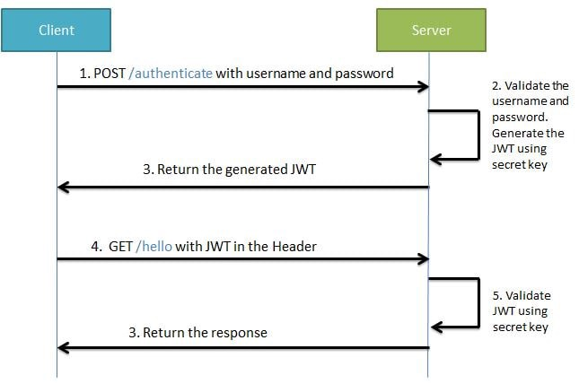
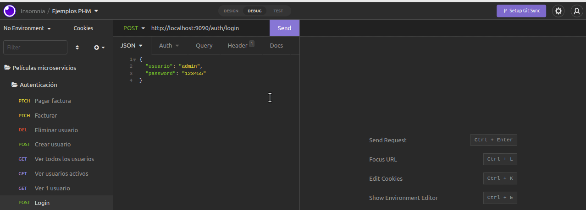
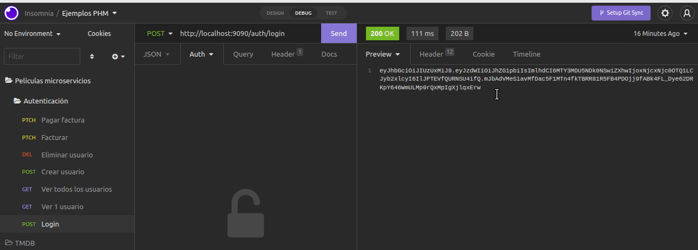

# Ejemplo Microservicios - Películas

## Módulo de autenticación

## Instrucciones para levantar el ejemplo

Desde el directorio raíz en un shell se levanta la base de datos PostgreSQL con docker compose:

```bash
docker-compose up
```

En el archivo [`docker-compose.yml`](./docker-compose.yml) especificamos la imagen dockerizada de Postgres que queremos utilizar y adicionalmente tenemos un [script de inicialización](./Docker/init_db.sh) que crea la base de datos `peliculas_auth` y le da accesos a un usuario que creamos también.

## El modelo de datos

Tenemos como entidad principal al usuario, la password se guarda encriptada en la base y tiene asociada la información de facturas (se factura en una fecha particular por un monto, y se puede pagar solo el total). Un usuario tiene muchas facturas.

## Endpoints

¿Qué podemos hacer dentro de este módulo?

- crear un usuario
- facturar a un usuario (con su id)
- pagar una factura con el id de usuario y de factura
- ver la información de los usuarios
- o de un usuario en particular
- y adicionalmente dar de baja un usuario (es una baja lógica, seguirá estando en la base)

## Mecanismos para securizar los endpoints

Este ejemplo utiliza Spring Security como tecnología de

- **autenticación:** la forma en que validamos que las credenciales de un usuario son correctas (una forma es mediante un nombre de usuario y su contraseña)
- **autorización:** verificando que cada usuario tenga permitido el uso de cada uno de los endpoints.

Existen múltiples frameworks que nos ayudan a completar este punto, pueden ver

- InMemoryUserDetailsManager: genera una base de usuarios en memoria cada vez que se levanta el servidor
- OAuth2: te podés integrar con servicios de autenticación externos, como tu correo de Google, Facebook, Github, etc.
- [Keycloak](https://www.keycloak.org/): provee un mecanismo de Single Sign On (SSO, o login unificado), federación de usuarios (cómo un usuario puede utilizarse en varios servidores sin tener que volver a generarlos)
- Basic Auth
- JWT (JSON Web Token), es la variante que nosotros decidimos implementar.

### JWT

[JWT](https://developer.okta.com/blog/2018/06/20/what-happens-if-your-jwt-is-stolen) representa 

- un token, un valor que almacena 
- información sobre la sesión asociada a un usuario identificado
- con formato JSON
- y firmado digitalmente, donde un algoritmo utiliza una clave como forma de encriptar los datos.

El estándar RFC 7519 define [JWT](https://jwt.io/) como un método que permite conectar dos partes, en nuestro caso un cliente y un servidor. El cliente puede ser cualquier aplicación construida con un frontend, o en este caso, dispararse vía POSTMAN / Insomnia.

Los pasos son

- el cliente pasa sus credenciales, en este caso usuario y contraseña (otro medio podría ser tener una [API Key](https://www.fortinet.com/resources/cyberglossary/api-key))
- el servidor valida el login: en caso exitoso le devuelve un token que contiene información como el usuario y el momento en que vence ese token. La información está encriptada utilizando algún algoritmo que el cliente desconoce.
- el cliente utilizará de aquí en más ese token para hacer los pedidos siguientes, de manera de no tener que pasar la contraseña cada vez que quiera ejecutar un endpoint

Esta forma de trabajo es especialmente útil para el protocolo http/s que es _stateless_, el servidor no guarda información de sesión. Entonces es responsabilidad del cliente almacenar el token y enviarlo en cada pedido, para que el server pueda identificar al usuario que realiza ese pedido.



## Login

### Implementación

El endpoint de login necesita recibir la información del usuario y la contraseña. Dado que todavía no nos identificamos, necesitamos que este endpoint no tenga ningún requerimiento de seguridad, debemos habilitarlo para que cualquier usuario anónimo verifique su identidad.

```kotlin
@Configuration
@EnableWebSecurity
class WebSecurityConfig {
   ...

   @Bean
   fun filterChain(httpSecurity: HttpSecurity, authenticationManager: AuthenticationManager): SecurityFilterChain {
      return httpSecurity
         .cors().disable()
         .csrf().disable()
         .authorizeHttpRequests()
         .requestMatchers(HttpMethod.POST, "/auth/login").permitAll()
         .requestMatchers("/error").permitAll()
         ...
         .and()
         .build()
```

> Un detalle importante de mencionar es que **también hay que habilitar la ruta `/error`**, de lo contrario cada vez que lancemos una excepción, en lugar de devolvernos un código de http 400, 404, etc. estaremos recibiendo un 401 ó 403 que nos dirá que no tenemos acceso a la ruta que tiene configurada Springboot para mostrar un mensaje de error.

Ahora que configuramos Spring Security para que permita pasar los pedidos de login, veamos cómo se implementa el controller:

```kotlin
@PostMapping("/login")
fun login(@RequestBody credencialesDTO: CredencialesDTO): String {
  usuarioService.login(credencialesDTO)
  return tokenUtils.createToken(credencialesDTO.usuario, credencialesDTO.password)!!
}
```

El service es el responsable de convertir las credenciales que contienen usuario y contraseña en un objeto de dominio Usuario. 

```kotlin
@Transactional(Transactional.TxType.REQUIRED)
fun login(credenciales: CredencialesDTO) {
  val usuario = usuarioRepository.findByNombre(credenciales.usuario).orElseThrow { CredencialesInvalidasException() }
  usuario.loguearse()
  usuario.validarCredenciales(credenciales.password)
}
```

Como detalle de implementación, registramos el último login por temas de auditoría y delegamos en el objeto de dominio la validación de contraseña, utilizando un algoritmo de encriptado. Pueden ver el código para más detalles.

### Generación del JWT

El componente TokenUtils encapsula las responsabilidades que generan el token en base a cierta información y permiten recuperar dicha información en base a un token. Veamos el código asociado a la creación de un token:

```kotlin
fun createToken(nombre: String, password: String): String? {
  val longExpirationTime = accessTokenMinutes * 60 * 60 * 1000
  val now = Date()

  return Jwts.builder()
     .setSubject(nombre)
     .setIssuedAt(now)
     .setExpiration(Date(now.time + longExpirationTime))
     .claim("roles", if (nombre == "admin") "ROLE_ADMIN" else "ROLE_USER")
     .signWith(Keys.hmacShaKeyFor(secretKey.toByteArray()))
     .compact()
}
```

Como dijimos antes, el token es un valor, en este caso un String, que se forma con la información del

- nombre del usuario, 
- el momento en que se emite el token, 
- el vencimiento, un token no es permanente sino que tiene un tiempo de validez por el cual simulamos una sesión abierta. Esa información se encripta junto con el token, recordamos que el servidor no almacena información en la VM de Springboot.
- y los roles, que permiten diferenciar perfiles de usuario. Dado que es un ejemplo didáctico, decidimos no incluir el rol dentro de la entidad Usuario, que sería lo más recomendable. En lugar de eso tenemos un único usuario admin que se asocia al rol ROLE_ADMIN (es importante respetar la convención de utilizar el prefijo `ROLE_`), y el resto de los usuarios tiene el rol común (`ROLE_USER`)

Para "firmar" el token utilizamos una clave que guardamos dentro de nuestro archivo `application.yml`

```yml
security:
  secret-key: ...clave...
  access-token-minutes: 300
```

y que se inyecta en nuestro componente TokenUtils:

```kotlin
@Component
class TokenUtils {
   @Value("\${security.secret-key}")
   lateinit var secretKey: String
```

¿Es entonces JWT un mecanismo infalible? Claro que no, pero para poder descubrir cómo generar tokens la persona atacante necesita saber cuál es el algoritmo de encriptado, la clave y un usuario/contraseña. Eso no quita que pueda robarnos un JWT válido con el que ganar acceso a la aplicación durante el tiempo que dure el token.

### Cómo se ve desde un cliente

Si ingresamos credenciales inválidas, la aplicación nos devuelve un código de error 401 (asociado a la excepción `CredencialesInvalidasException`), en caso contrario nos devuelve nuestro JWT:



## Acceso a los otros endpoints mediante el token

Una vez obtenido el token, un frontend común lo que hace es

- lo guarda en algún medio semi-persistente (ej: _local storage_ del navegador o incluso un mapa en memoria)
- de aquí en más cada vez que realizamos un pedido al backend interceptamos el header y le agregamos el token
- debemos manejar adicionalmente la ausencia de dicho token, redirigiendo a la página de login primero (e idealmente almacenando cuál era la ruta a la que queríamos acceder para ir allí una vez validado el usuario)

En nuestro caso, lo que vamos a hacer en el cliente Insomnia es llamar a los endpoints utilizando _Bearer Token_ como mecanismo de autenticación (pasamos el token que nos devolvió el login):



## Cómo testear la aplicación

Levantar en Insomnia los endpoints importando [este archivo](./auth_insomnia.json).

