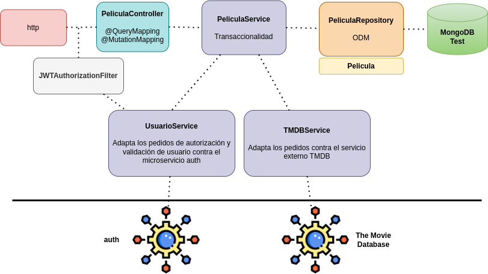
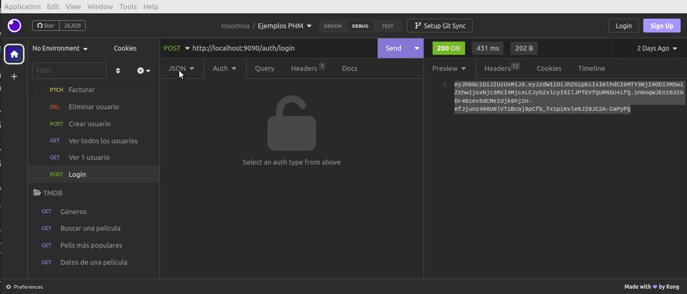
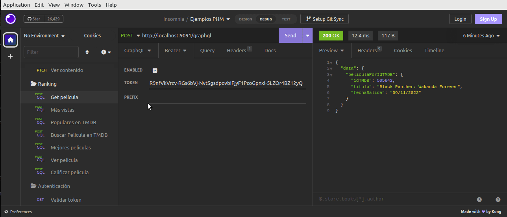
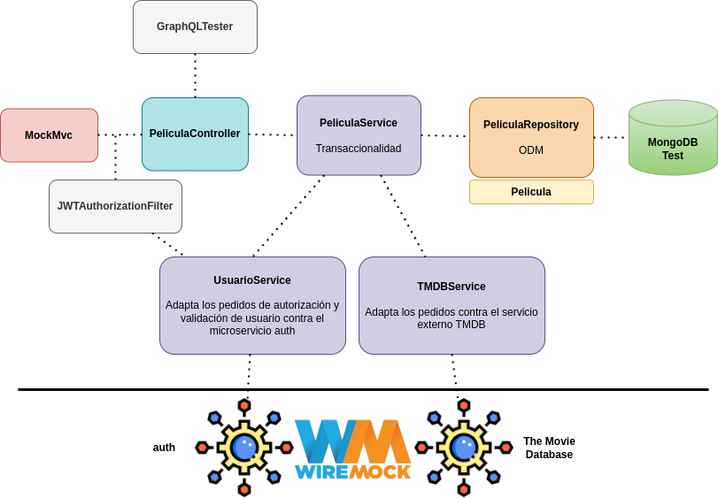

# Ejemplo Microservicios - Películas

## Módulo Ránking de películas

[](https://github.com/uqbar-project/eg-peliculas-microservicios/actions/workflows/build-ranking.yml) [](https://codecov.io/gh/uqbar-project/eg-peliculas-microservicios)

Este módulo permite

- visualizar información de las películas
- indicar que se ve una determinada película
- calificar una película
- hacer búsquedas de una película

## Instrucciones para levantar el ejemplo

Desde el directorio raíz en un shell se levanta la base de datos MongoDB con docker compose:

```bash
docker-compose up
```

En el archivo [`docker-compose.yml`](./docker-compose.yml) especificamos la imagen dockerizada de Mongo que queremos utilizar y adicionalmente tenemos un [script de inicialización](./Docker/mongo-init.js) que genera el usuario con roles de administración.

Antes de levantar la aplicación conviene levantar [el proyecto hermano que tiene la registración de los servicios en Eureka](../peliculas-microservice-registry/README.md).

Después sí, ejecutás el main del archivo PeliculasMicroserviceRankingApplication.

## Conceptos salientes

- Medio persistente: base de datos documental creada desde Docker
- Mapeo OD/M con Spring Boot
- Los endpoints están manejados con GraphQL, eso permite manipular la información que se quiera de las películas
- La información de las películas se obtiene de [TMDB (The Movie Database)](https://www.themoviedb.org/), para lo cual tenés que pedir una API Key propia y ubicarla dentro del archivo `application-localhost.yml` del raíz de este proyecto

```yml
tmdb:
  api-key: <tu API key>

```

Dado que es información sensible, **no la subimos a git** (está ignorado en el archivo `.gitignore` raíz del monorepo). Esta es una práctica recomendable para no compartir claves, especialmente en un lugar tan público como github / gitlab.

## Arquitectura general



Este microservicio trabaja con tres objetos principales: la película, sus géneros y sus calificaciones. El mapeo se hace contra una base documental, que se resuelve con Spring Boot. 

Además interactúa con otros dos (micro)servicios:

- `auth` que forma parte de este monorepo, para la autenticación y verificación del usuario
- `TMDB` (The Movie Database), un servicio externo que permite acceder a una base de películas actualizada

## Seguridad

Para poder validar los endpoints utilizamos un token de seguridad JSON (JSON Web Token), que se lo pasamos en cada request como un Bearer Token. Para obtener el token llamamos al endpoint de login provisto por el microservicio **auth**:



Para validar el usuario, utilizamos un interceptor o _Filter_ de Spring Boot:

```kt
@Component
class JWTAuthorizationFilter : OncePerRequestFilter() {

    @Autowired
    lateinit var usuarioService: UsuarioService

    override fun doFilterInternal(
        request: HttpServletRequest,
        response: HttpServletResponse,
        filterChain: FilterChain
    ) {
        var authorized = false
        val bearerToken = request.getHeader("Authorization")
        if (bearerToken != null && bearerToken.startsWith("Bearer ")) {
            val token = bearerToken.replace("Bearer ", "")
            authorized = usuarioService.authorize(token)
        }

        if (authorized) {
            filterChain.doFilter(request, response)
        } else {
            response.status = 401
        }
    }

}
```

En él hacemos la llamada a UsuarioService que es el adapter que delega al microservicio auth y que en caso de pasar correctamente el login almacena la información del usuario logueado.

En caso contrario, veremos un código de http 401 (unauthorized), por ejemplo si pasamos el token de un usuario que fue eliminado:



## Testing

### GraphQLTester

La novedad es que para poder testear tenemos dos estrategias:

- **GraphQLTester** no trabaja con el protocolo http, por lo tanto ciertas funcionalidades (como la validación del token que hace el Filter) no están disponibles
- **MockMvc** sigue utilizando http como protocolo, por lo que es útil para hacer pruebas de usuarios que no tienen acceso a la aplicación

Como GraphQLTester es más simple en todos los tests _happy path_ (exitosos) utilizamos la primera variante.

### Wiremock

La otra característica es que trabajamos con **Wiremock** para simular pedidos por http. Ahora bien

- dado que trabajamos con dos servicios distintos, podríamos pensar en configurarle a Wiremock dos servers/puertos diferentes
- pero además dado que TMDB funciona por https, necesitamos generar un certificado para nuestro server interno de Wiremock (algo que no resulta sencillo de resolver)

Entonces una solución mucho más fácil es tener un environment de test que defina tanto a TMDB como a auth en el mismo server:

```yml
# application-test.yml
tmdb:
  api-key: 11111111111111
  base-url: http://localhost:9080

auth:
  base-url: http://localhost:9080
```

Claro, solo para test. De esa manera podemos trabajar con Wiremock con una sola configuración, diferenciando auth y TMDB en base a los paths a los que apunta cada endpoint:

```kt
    @BeforeEach
    fun setup() {
        ...
    
        wireMockServer = WireMockServer(
            options()
                .enableBrowserProxying(true)
                .port(9080)
        )
        wireMockServer.start()

        JvmProxyConfigurer.configureFor(wireMockServer)

        wireMockServer.stubFor(
            get("/auth/users/user1")...

        wireMockServer.stubFor(
            get("/movie/1?api_key=11111111111111&language=en-US")...

```

La base de datos por otra parte es la real (no hay base embebida ni en memoria). Los tests deben ser, por lo tanto, idempotentes.



